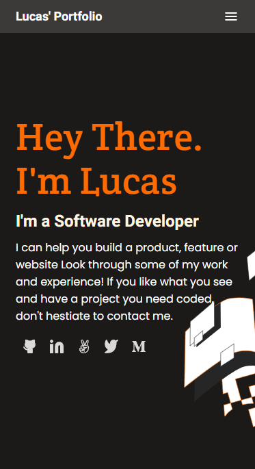

# Portfolio

> Project made to build my portfolio during the Microverse program.

## Built With

- HTML
- CSS
- Linters
- Figma templates

## Live Demo

[Live Demo Link](https://ryxtor.github.io/Portfolio/)

## Author

👤 **Lucas Bonnefon**

- GitHub: [@ryxtor](https://github.com/ryxtor)
- Twitter: [@ryxtor](https://twitter.com/ryxtor)
- LinkedIn: [Lucas Bonnefon](https://www.linkedin.com/in/lucas-bonnefon-074a01134/)

## Collaborator

👤 **Juan Luis Palacios**

- GitHub: [@JuanLPalacios](https://github.com/JuanLPalacios)
- Twitter: [@JuanLuisPalac20](https://twitter.com/JuanLuisPalac20)
- LinkedIn: [LinkedIn](https://www.linkedin.com/in/juan-luis-palacios-p%C3%A9rez-95b39a228/)

## 🤝 Contributing

Contributions, issues, and feature requests are welcome!

## 📝 License

This project is [MIT](./MIT.md) licensed.
